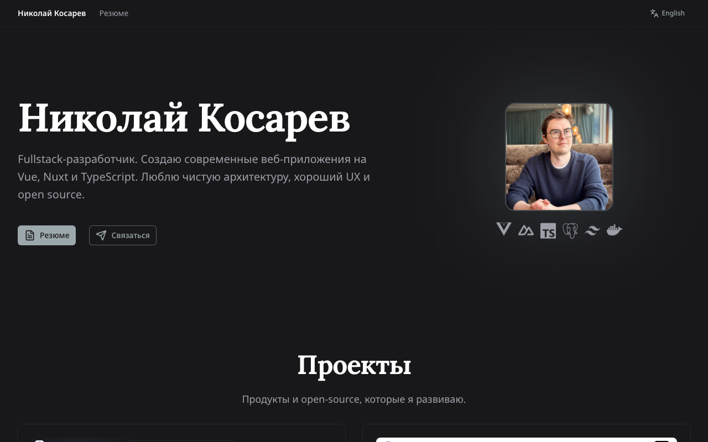

# kosarev.space

Personal portfolio and CV website — [kosarev.space](https://kosarev.space)



## Stack

- **Nuxt 4** + **Vue 3** + **TypeScript**
- **Nuxt UI v4** + **Tailwind CSS v4**
- **i18n** — Russian / English
- **Playwright** — E2E tests + CV PDF generation
- **Vitest** — unit tests
- **Docker** + **Kubernetes** — deployment
- **GitHub Actions** — CI/CD

## Setup

```bash
pnpm install
```

Copy env file and fill in values:

```bash
cp apps/web-app/.env.example apps/web-app/.env
```

## Development

```bash
pnpm --filter @kosarev/web-app dev
```

## Scripts

| Command | Description |
|---|---|
| `pnpm run lint` | ESLint |
| `pnpm run typecheck` | Type check |
| `pnpm run test` | Unit tests |
| `pnpm run test:e2e` | E2E tests (Playwright) |
| `pnpm run build` | Production build + CV PDFs |
| `pnpm run check:full` | All checks at once |

## Project structure

```
apps/web-app/
├── app/
│   ├── components/    # Vue components
│   ├── composables/   # Composables (useDuration, useHighlights)
│   ├── layouts/       # Page layouts
│   ├── pages/         # Routes (/, /cv, /cv/print)
│   ├── plugins/       # Yandex Metrika
│   └── utils/         # Data, duration helpers
├── i18n/locales/      # Translation files
├── server/routes/     # CV PDF serving
└── scripts/           # PDF generation at build time
```

## License

MIT
